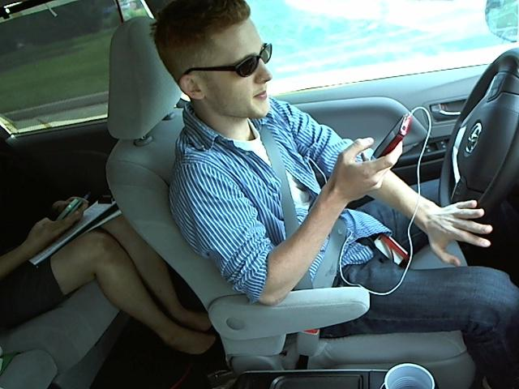

## Detecting Distracted Drivers

The objective of this work is to successfully predict the likelihood of what a driver is doing in each of the pictures in the dataset[1](#kaggle).

The data consists on a set of images, each taken in a car where the driver is doing some action (e.g. texting, talking on the phone, doing their makeup). These are some examples:

  

The images are labeled following a set of 10 categories:

|Class|Description|
|-----|-----------|
| `c0` | Safe driving. |
| `c1` | Texting (right hand). |
| `c2` | Talking on the phone (right hand). |
| `c3` | Texting (left hand). |
| `c4` | Talking on the phone (left hand). |
| `c5` | Operating the radio. |
| `c6` | Drinking. |
| `c7` | Reaching behind. |
| `c8` | Hair and makeup. |
| `c9` | Talking to passenger(s). |

 

## Running the Code

### Dependencies

* `Python 3.6.1`
* `Tensorflow 1.3.0`
* `Keras 2.1.2`
* `matplotlib 2.0.2`
* `numpy 1.12.1`

### Command-line Execution

* **Simple CNN in Keras**

	Directory Path: `/src/keras/base`

	* **Train the model**: `python train.py [-h] [--bsize BSIZE]`

		Optional arguments:
	
		| | |
		|-------------|--------|
		|`-h`, `--help`|show help message and exit |
		|`--bsize BSIZE`|provide batch size for training (default: 40)|
	
	* **Test the model**: `python test.py [-h]`
	
	* **Predict from an image**: `predict.py [-h] [--image IMAGE] [--hide_img]`

		Optional arguments:
	
		| | |
		|-------------|--------|
		|`-h`, `--help`|show help message and exit |
		|`--image IMAGE`|path to image|
  		|`--hide_img`|do NOT display image on prediction termination|

* **CNN with VGG16 Transfered Learning**

	Directory Path: `/src/keras/vgg`
	
	* **Extract VGG16 deep features**: `python extract_vgg16_features.py [-h]`

	* **Train the model**: `python train_top.py [-h]`
	
	* **Test the model**: `python test.py [-h] [--acc] [--cm] [--roc]`

		Optional arguments:
	
		| | |
		|-------------|--------|
		|`-h`, `--help`|show help message and exit |
		|`--acc`|will calculate loss and accuracy|
		|`--cm`|will plot confusion matrix|
		|`--roc`|will plot roc curve|
	
	* **Predict from an image**: `predict.py [-h] [--image IMAGE] [--hide_img]`

		Optional arguments:
	
		| | |
		|-------------|--------|
		|`-h`, `--help`|show help message and exit |
		|`--image IMAGE`|path to image|
  		|`--hide_img`|do NOT display image on prediction termination

	*Note: Since the notebooks may not all be fully updated yet, the best way to run these programs is using the python scripts.*

 

---

<a name="kaggle">1</a>: This dataset is available on Kaggle, under the State Farm competition [Distracted Driver Detection](https://www.kaggle.com/c/state-farm-distracted-driver-detection).